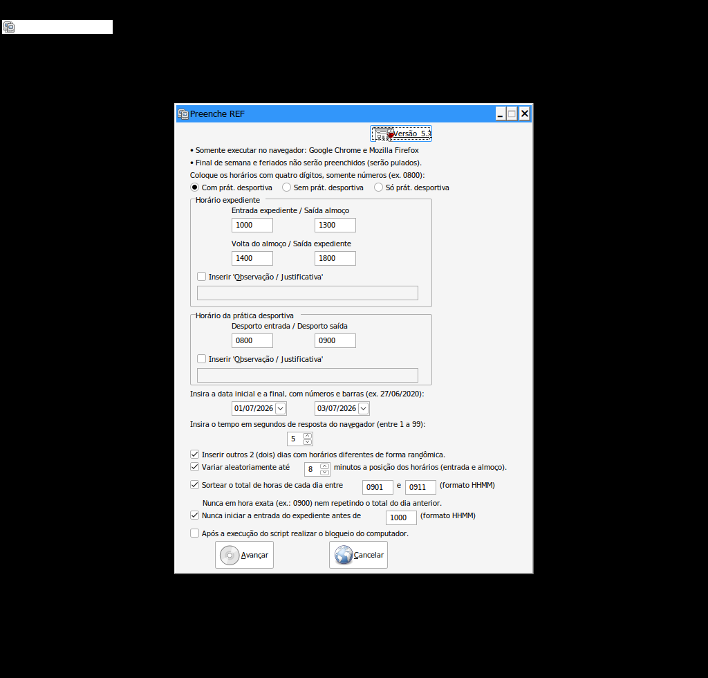

# Preenche REF v5.3

Versão melhorada do utilitário **Preenche REF** — automação de preenchimento do
Registro Eletrônico de Frequência (REF) via navegador (Chrome/Firefox).

O programa original (`Preenche_REF_v4.2.exe`) é um script AutoHotkey v1
compilado. O código-fonte foi extraído do próprio executável (fica embutido
como recurso `>AUTOHOTKEY SCRIPT<`) e está preservado em
[`original/Preenche_REF_v4.2_extraido.ahk`](original/Preenche_REF_v4.2_extraido.ahk)
para referência.

## O problema da v4.2

A v4.2 pula finais de semana e feriados, porém os **feriados móveis
(Carnaval, Sexta-feira Santa e Corpus Christi) estavam em uma lista fixa que
só cobria os anos de 2020 a 2025**. A partir de 2026 o programa passaria por
cima desses dias — por exemplo, o Carnaval de 16 e 17/02/2026 seria
preenchido como dia útil.

## Melhorias

| Versão | Melhoria |
|--------|----------|
| 5.3 | **Prática desportiva às 08:00–09:00 por padrão e com horário fixo** (não sofre a variação aleatória — fica sempre 08:00–09:00). |
| 5.2 | **Entrada do expediente nunca antes de um mínimo** (padrão **10:00**) — nova opção marcada por padrão, com validação na entrada e nos dias 2/3. Os horários-padrão da tela foram deslocados para começar às 10:00. |
| 5.2 | **Faixa padrão do total diário passou para 09:01–09:11** (sempre um pouco acima de 9h, nunca 9h cravado). Continua editável. |
| 5.1 | **Sorteio do total de horas de cada dia** dentro de uma faixa configurável. O sorteio nunca cai em hora exata (ex.: 09:00 cravado) e nunca repete o total do dia anterior. A **saída do expediente** é ajustada para fechar o total sorteado; entrada e almoço continuam variando pela posição. Quando há prática desportiva, a duração dela conta dentro do total. Com o sorteio ativo, o antigo aviso de "8 horas" é dispensado. |
| 5.0 | **Feriados móveis calculados para qualquer ano** (algoritmo de Meeus/Butcher para a Páscoa → Carnaval seg/ter, Sexta-feira Santa e Corpus Christi). Sem data de validade. |
| 5.0 | **Variação aleatória opcional da posição dos horários** (padrão até ±8 min, configurável de 1 a 30): cada bloco do dia é deslocado inteiro por um sorteio próprio, sem sobreposição entre blocos. |
| 5.0 | **Progresso durante a execução**: o balão mostra qual dia está sendo preenchido (`Preenchendo 05/03/2026 (dia 3 de 22)`) ou pulado (fim de semana/feriado). |
| 5.0 | Correções de texto e consolidação interna do código (24 blocos repetidos de espera viraram uma função). |

A mecânica de preenchimento (sequências de Tab/Espaço no navegador) foi
**mantida idêntica** à v4.2, que já é comprovada em uso — as melhorias mudam
apenas o que decide *quais dias* e *quais horários*, não *como* digitar.



### Como funciona o sorteio do total (v5.1)

Para cada dia útil:

1. Sorteia-se um total em minutos dentro da faixa (ex.: 531 a 551 = 8h51 a 9h11);
2. Se o valor cair em hora exata (múltiplo de 60, como 540 = 9h00) ou for
   igual ao total do dia anterior, sorteia-se de novo;
3. A saída do expediente é recalculada:
   `saída = volta do almoço + (total − desporto − manhã trabalhada)`;
4. Antes de aceitar, verifica-se que a saída não passa de 23:59 e não invade
   o horário da prática desportiva.

Exemplo real gerado nos testes (base 09:00–12:00 / 13:00–17:00 + desporto
20:00–21:00): `08:58–11:58 / 12:57–17:52`, `08:53–11:53 / 13:06–18:11`,
`09:05–12:05 / 12:54–17:57` — totais 8h55, 9h05, 9h03…

## Validação realizada

Sem acesso ao sistema real, a validação foi feita com o **runtime AutoHotkey
1.1.33.10 verdadeiro** (o mesmo embutido no executável), sob Wine:

- **Parse completo** do script v5.3 sem nenhum erro de sintaxe;
- A função de feriados, executada de 2020 a 2027, reproduziu **exatamente
  os 24 valores da lista fixa original (2020–2025)** e gerou 16–17/02/2026
  (Carnaval), 03/04/2026 (Sexta Santa) e 04/06/2026 (Corpus Christi) — os dias
  de Carnaval conferem com a marcação "(PF)" exibida pelo próprio REF;
- **900 dias simulados** de sorteio de horários sem violar nenhuma regra:
  total sempre na faixa, nunca em hora exata, nunca repetido do dia anterior,
  desporto de 1h intacto, sem sobreposição, e todos os 20 totais possíveis
  da faixa padrão foram usados;
- Com o sorteio desligado, o comportamento antigo (total preservado) se mantém;
- A interface gráfica foi aberta sob Wine e verificada visualmente.

**Ainda assim, no primeiro uso real, teste com um intervalo de um único dia e
confira o resultado na tela antes de enviar para homologação.**

## Como obter o executável

O `.exe` não fica no repositório. Três caminhos:

1. **Injeção no executável original** (não precisa instalar AutoHotkey):

   ```
   pip install pefile
   python tools/injeta_script.py Preenche_REF_v4.2.exe src/Preenche_REF_v5.3.ahk Preenche_REF_v5.3.exe
   ```

   O script novo é gravado por cima do recurso interno do exe antigo, sem
   alterar nenhum outro byte (o processo foi validado com ida-e-volta
   byte-a-byte). O tamanho do script deve caber no espaço original
   (45.199 bytes; a v5.3 usa 45.172).

2. **Rodar o `.ahk` direto**: instale o [AutoHotkey v1.1](https://www.autohotkey.com)
   (existe versão portátil, sem admin) e dê dois cliques em
   `src/Preenche_REF_v5.3.ahk`.

3. **Compilar do zero**: com o AutoHotkey instalado, use o Ahk2Exe
   (`Convert .ahk to .exe`) apontando para `src/Preenche_REF_v5.3.ahk`.

## Ferramentas (`tools/`)

| Script | Função |
|--------|--------|
| `extrai_script.py` | Extrai o `.ahk` embutido de qualquer exe AutoHotkey v1 compilado. |
| `injeta_script.py` | Regrava o recurso de script de um exe AutoHotkey com outro `.ahk` (mesmo tamanho, preenchido com quebras de linha; recalcula o checksum do PE). |
| `gera_v5.py` | Gera `src/Preenche_REF_v5.3.ahk` a partir do fonte extraído da v4.2, aplicando cada alteração por substituição textual verificada — serve de changelog executável. |

## Limitações conhecidas (herdadas do método)

A automação é "cega": envia teclas e confia que o foco do navegador está no
lugar certo, com esperas fixas entre ações. Durante a execução não se pode
usar mouse nem teclado, e dias já preenchidos não são detectados.

## Versão web (v6) — em construção

Já começou, na pasta [`v6-web/`](v6-web/): um script que roda **dentro da
página** do REF. A **Parte 1 (analisador)** está pronta e testada — pinta os
dias de verde/cinza/amarelo e diz exatamente quais faltam preencher, sem
lista de feriados. A **Parte 2 (preenchedor)** depende de mais uma captura da
tela; veja o passo a passo no README da pasta.

### Por que uma v6 (mudança de método)

O .exe trabalha "por fora": finge ser alguém digitando, com esperas fixas, e
não enxerga a tela. Um script rodando **dentro da página** trabalha "por
dentro": lê os dias direto da tabela (sem lista de feriados), pula os que já
têm registro e escreve nos campos sem esperas nem travar o computador. É o que
a v6 faz — detalhes e passo a passo em [`v6-web/README.md`](v6-web/README.md).
