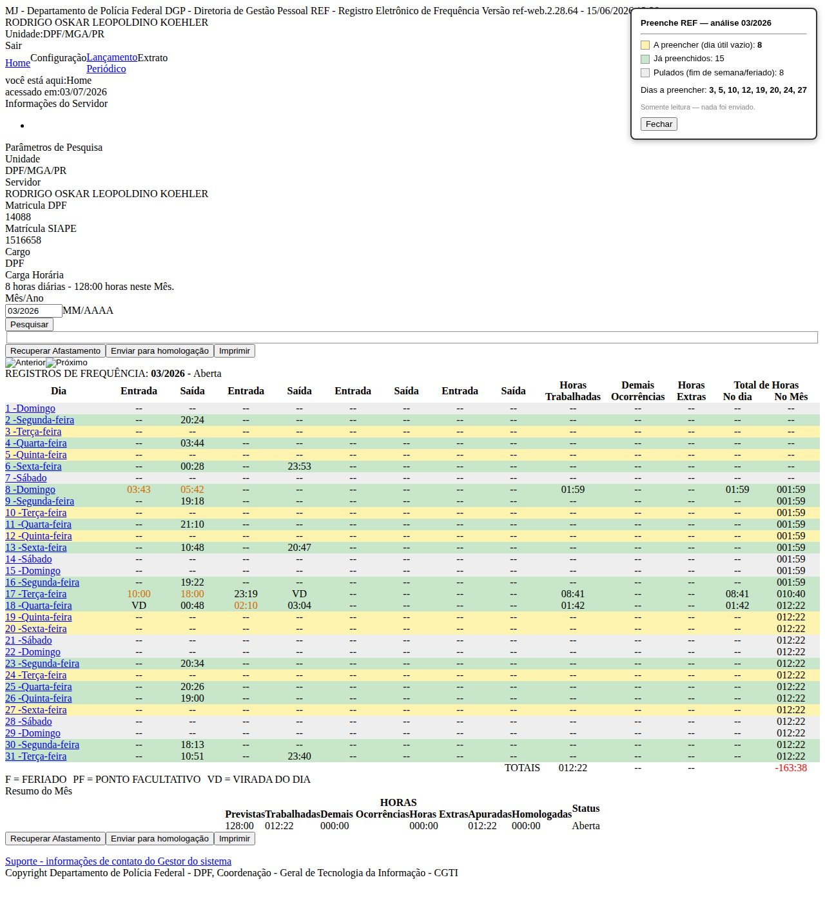
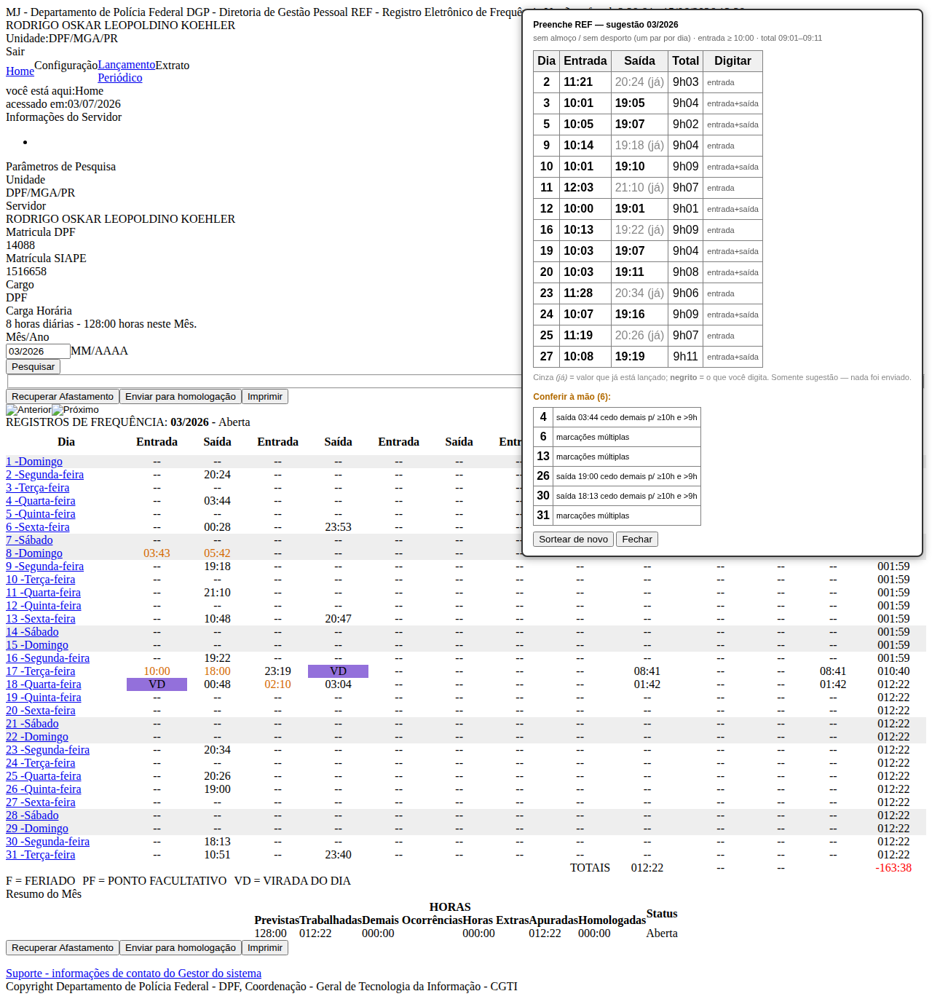

# Preenche REF v6 (versão web) — em construção

A ideia da v6 é **abandonar a digitação cega** (o método do .exe, que envia
teclas e reza para o foco estar no lugar) e passar a agir **de dentro da
própria página** do REF, que é onde a informação realmente está.

Vantagens do método novo:

- **Não precisa de lista de feriados** — o script lê o mês/ano da tela e
  calcula os feriados (inclusive Carnaval/Sexta Santa/Corpus, que mudam de
  data) para aquele ano;
- **Enxerga o que já foi preenchido** — não repassa por cima de dias que já
  têm horário;
- **Sem esperas de segundos** e sem travar o mouse/teclado.

## Parte 1 — Analisador (pronta) ✅

[`analisador_ref.js`](analisador_ref.js) roda dentro da página e **só lê**:
pinta cada dia de **verde** (já preenchido), **cinza** (fim de semana ou
feriado, não precisa) ou **amarelo** (dia útil ainda vazio), e mostra um
resumo no canto com a lista exata dos dias que faltam.

Já foi testado contra uma página real do REF (março/2026): identificou
corretamente 15 dias preenchidos, 8 dias úteis a preencher e 8 fins de semana,
e calculou os feriados móveis conferindo com o teste do programa em AutoHotkey.

### Como usar (não precisa instalar nada)

1. Abra a tela do REF no mês desejado, no **Chrome** ou **Firefox**;
2. Tecle **F12** (abre as Ferramentas do Desenvolvedor);
3. Clique na aba **Console**;
4. Abra o arquivo `analisador_ref.js`, copie **todo** o conteúdo, cole no
   Console e tecle **Enter**.

A página é colorida e o resumo aparece no canto superior direito. Nada é
enviado — é seguro. Para analisar outro mês, navegue até ele e cole de novo.

> Dica: se aparecer um aviso pedindo para digitar `allow pasting` antes de
> colar, digite isso e tecle Enter — é uma proteção do navegador, normal.

## Parte 2a — Sugestor de horários (pronta) ✅

[`sugere_horarios_ref.js`](sugere_horarios_ref.js) roda dentro da página e,
para cada dia útil que precisa de lançamento, **mostra numa tabela os horários
a digitar**, seguindo as regras da v5.2: entrada nunca antes de 10:00, total
diário entre 09:01 e 09:11 (nunca em hora exata nem repetindo o dia anterior),
pequena variação de posição.

O que o torna esperto: ele **lê o que já existe** em cada dia e sugere só o que
falta —

| Situação do dia | O que sugere |
|-----------------|--------------|
| Vazio | entrada **e** saída |
| Só com a saída (ponto automático) | **só a entrada** (mantém a saída existente) |
| Só com a entrada | **só a saída** |
| Já completo | pula |
| Marcações duplas, ou horário que não fecha ≥10h e >9h (plantão/sobreaviso) | **não chuta** — marca "conferir à mão" |

Na tabela, o valor em **negrito** é o que você digita; o cinza *(já)* é o que
já está no sistema. Opções (com/sem almoço, com/sem desporto, faixa de total,
mínimo de entrada) ficam no bloco `CONFIG` no topo do arquivo. Botão
**"Sortear de novo"** gera outra combinação.

Testado: validação numérica das três ramificações (dia vazio, completar
entrada, completar saída) sem violar regra, e execução contra a página real —
completou os dias limpos e sinalizou corretamente os ambíguos (marcações
duplas e saídas cedo demais).

Uso: igual ao analisador (F12 → Console → colar → Enter). Ele lê o mês/ano da
própria tela e **respeita as marcações "(F)" (feriado) e "(PF)" (ponto
facultativo)** que o REF mostra ao lado do dia, além de calcular os feriados.
O `CONFIG` que acompanha o arquivo já vem para o padrão pedido: **com almoço e
com desporto fixo 08:00–09:00**, entrada ≥10:00, total 09:01–09:11.

## Parte 2b — Preenchimento automático (a fazer) ⏳

Falta a parte que **preenche e salva** os dias sozinha. Para construí-la com
segurança eu preciso ver o formulário de lançamento **no modo manual** — que
**não** está na página que você salvou, porque ele só é carregado quando você
marca "Registro Manual de Frequência" (aí o rádio dispara um `A4J.AJAX.Submit`
e o servidor devolve os campos de hora). Os nomes internos desses campos são
gerados na hora (ex.: `formInclusao:j_id652`) e mudam a cada sessão, então o
preenchedor terá que localizá-los pela estrutura.

Para isso, preciso ver os campos do **modo manual**. Como o REF é servido por
HTTP, o Chrome **bloqueia downloads** (o `captura_modal_ref.js` cai nisso), então
o jeito robusto é o [`inspeciona_modal.js`](inspeciona_modal.js), que **não baixa
nada** — mostra os campos numa caixa de texto para copiar e colar:

1. Clique num dia **vazio** para abrir a janelinha "Detalhamento dos Registros";
2. Marque **"Registro Manual de Frequência"** (aparecem os campos de hora);
3. F12 → Console, cole o `inspeciona_modal.js` e tecle Enter;
4. Surge uma caixa no canto superior **esquerdo** com o texto **já selecionado**
   — tecle **Ctrl+C** e cole o conteúdo na conversa.

O `captura_modal_ref.js` (download do HTML inteiro) fica como alternativa para
quando o REF estiver em HTTPS.

Com esse texto eu escrevo e testo o preenchedor da mesma forma que testei o
analisador e o sugestor.

### Por que um userscript, e não continuar no .exe?

O .exe (AutoHotkey) funciona "por fora": ele finge ser um usuário digitando.
Isso é frágil — qualquer clique atrapalha, e ele não sabe o que está na tela.
Um *script de página* trabalha "por dentro": lê e escreve nos campos
diretamente, com certeza do que está fazendo. É o mesmo motivo pelo qual esta
Parte 1 já consegue dizer, com exatidão, quais dias faltam — algo que o .exe
nunca soube.
